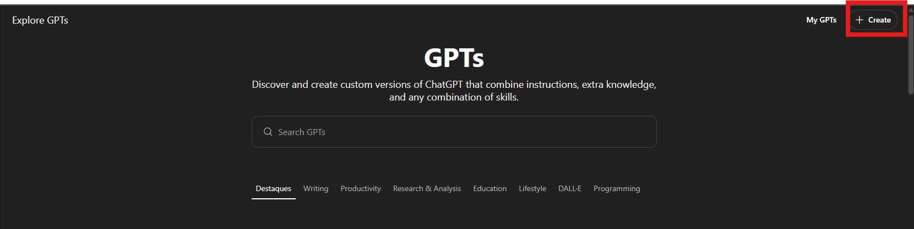
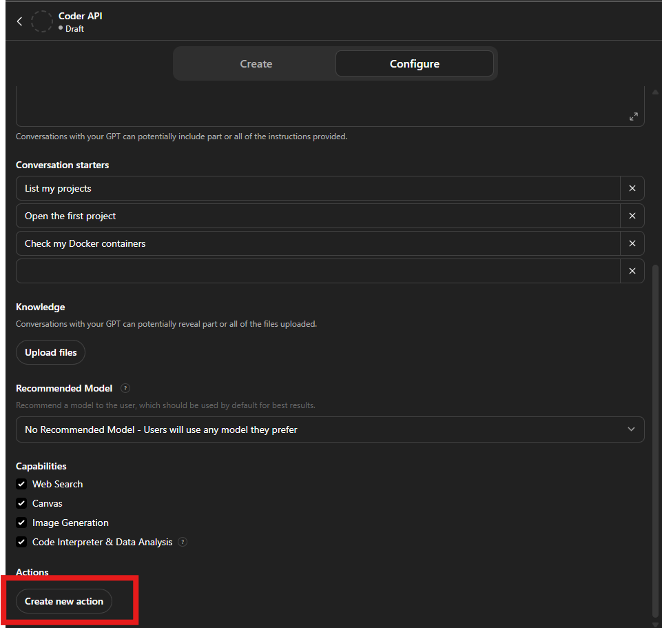
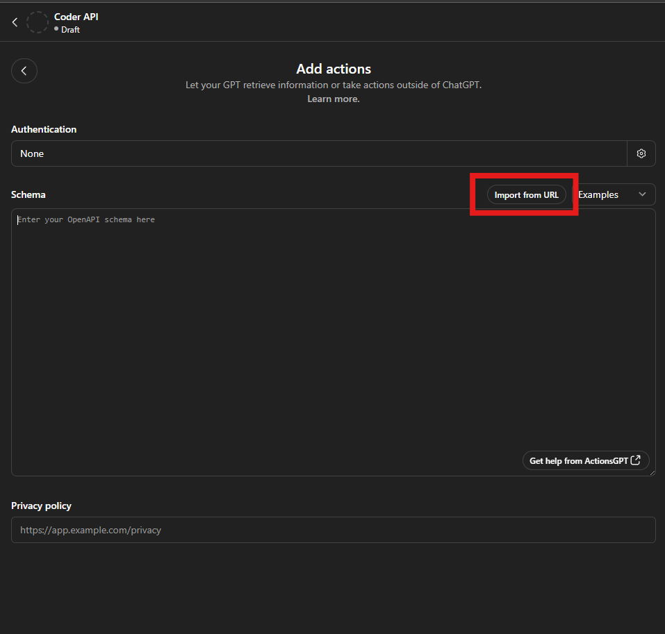
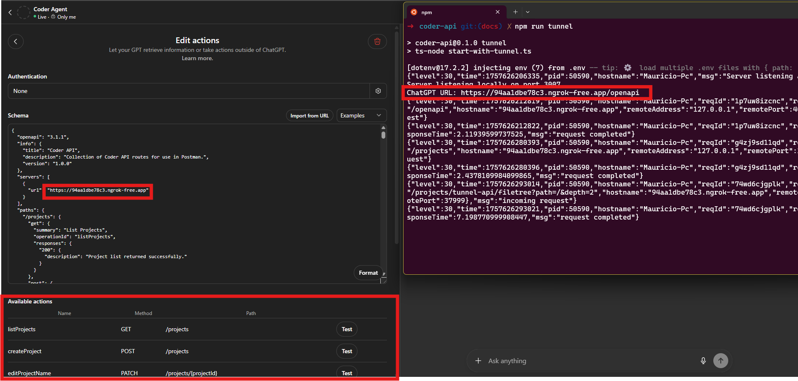

# Coder-API

A backend for an autonomous agent to be used through the ChatGPT UI. 


## How it works
- Coder-API runs on your computer and lets you access your files, folders, terminal.
- A tunnel connects your local API to the internet using Ngrok.
- Ngrok creates a link so that external services (like GPT) can reach your Coder-API.
- GPT (or other AI tools) can now interact with your computer’s resources by sending requests through this tunnel.


## Features


The server provides the following capabilities:

#### Project Management
- `create-project` - Create new projects from Git repositories, archives, or empty directories
- `rename-project` - Rename existing projects
- `list-projects` - Get a list of all projects
- `get-project-details` - Get detailed information about a specific project

#### File Operations
- `get-file` - Read file contents with support for text and base64 encoding
- `create-file` - Create new files with overwrite protection
- `delete-file` - Delete files or directories with recursive options
- `patch-file` - Apply modifications using various patch operations (diff, replace, lines, insert, code_block)

#### System Operations
- `run-bash` - Execute bash commands in project directories with timeout and environment controls
- `list-filetree` - Browse project file structures with configurable depth and entry limits

## How we build it 

- Express server with dual protocol support:
  - **REST API** for traditional HTTP-based project and file management
  - **MCP (Model Context Protocol)** for seamless LLM integration
- OpenAPI contract (`openapi.json`)
- Multiple transport options for MCP (HTTP and Server-Sent Events)
- 
## Getting Started 

- Node.js >= 20
- [pnpm](https://pnpm.io/) (recommended)
- Docker (optional)

## Setup Local

1. **Clone the repository:**
   ```sh
   git clone https://github.com/MauricioMilano/coder-api.git
   cd coder-api
   ```

2. **Install dependencies:**
   ```sh
   pnpm install
   ```

3. **Configure environment variables:**
   Create a `.env` file (example) and update `WORKSPACE_ROOT` with the folder that will be your projects. This folder must start empty:
   ```
   PORT=3000
   WORKSPACE_ROOT=/srv/workspace
   ALLOW_NETWORK=false
   MAX_FILE_SIZE=5000000
   MAX_STDOUT_BYTES=2000000
   BASH_TIMEOUT_SEC=120
   MAX_UPLOAD_MB=20
   ```

4. **Run in development:**
   ```sh
   pnpm dev
   ```

5. **Build and run in production:**
   ```sh
   pnpm build
   pnpm start
   ```


## Deployment Options

To allow external services (like ChatGPT or other AI assistants) to access your Coder-API, you need to make it accessible over the internet. Here are several deployment options:

### Option 1: Self-Hosted Server

Deploy Coder-API on your own server with a public IP address or domain:

#### Using Docker

1. **Build the Docker image:**
   ```sh
   docker build -t coder-api .
   ```

2. **Run with Docker:**
   ```sh
   docker run -d \
     --name coder-api \
     -p 3000:3000 \
     -v /path/to/workspace:/srv/workspace \
     -e WORKSPACE_ROOT=/srv/workspace \
     coder-api
   ```

#### Direct Deployment

1. **On a VPS/Cloud Server:**
   ```sh
   # Clone and setup
   git clone https://github.com/MauricioMilano/coder-api.git
   cd coder-api
   pnpm install
   pnpm build
   
   # Configure environment
   cp .env.example .env
   # Edit .env with your settings
   
   # Start with PM2 (recommended)
   npm install -g pm2
   pm2 start npm --name "coder-api" -- start
   pm2 startup
   pm2 save
   ```

2. **Configure reverse proxy (nginx example):**
   ```nginx
   server {
       listen 80;
       server_name your-domain.com;
       
       location / {
           proxy_pass http://localhost:3000;
           proxy_http_version 1.1;
           proxy_set_header Upgrade $http_upgrade;
           proxy_set_header Connection 'upgrade';
           proxy_set_header Host $host;
           proxy_set_header X-Real-IP $remote_addr;
           proxy_set_header X-Forwarded-For $proxy_add_x_forwarded_for;
           proxy_set_header X-Forwarded-Proto $scheme;
           proxy_cache_bypass $http_upgrade;
       }
   }
   ```

3. **Access your API:**
   - REST API: `https://your-domain.com/openapi`
   - MCP HTTP: `https://your-domain.com/mcp`
   - MCP SSE: `https://your-domain.com/mcp-sse`

### Option 2: Cloud Platform Deployment

#### Render/Heroku
Deploy using your platform's standard Node.js deployment process.

### Option 3: Local Tunneling with Ngrok

For development and testing, you can quickly expose your local server using [ngrok](https://ngrok.com/):

1. **Configure ngrok:**
   ```sh
   # Create a free ngrok account at https://dashboard.ngrok.com
   # Get your authtoken and configure it
   npx ngrok config add-authtoken $YOUR_AUTHTOKEN
   ```

2. **Start the server with tunnel:**
   ```sh
   pnpm tunnel
   ```

3. **You'll get output like:**
   ```
   {"level":30,"time":1757608557875,"pid":7446,"hostname":"Mauricio-Pc","msg":"Server listening at http://0.0.0.0:3007"}
   Server listening locally on port 3007
   ChatGPT URL: https://my123url.ngrok-free.app/openapi
   ```

4. **Use the ngrok URL for:**
   - ChatGPT Actions: `https://your-url.ngrok-free.app/openapi`
   - MCP clients: `https://your-url.ngrok-free.app/mcp`

### Option 4: Other Tunneling Services

- **Cloudflare Tunnel:** Free, no account limits
  ```sh
  npx cloudflared tunnel --url http://localhost:3000
  ```

- **LocalTunnel:** Simple, no signup required
  ```sh
  npx localtunnel --port 3000
  ```

---

## Model Context Protocol (MCP) Support

This project now supports the **Model Context Protocol (MCP)**, enabling seamless integration with AI assistants and LLMs. MCP provides a standardized way for AI models to interact with external tools and resources.

### MCP Transport Options

The server supports multiple transport methods for MCP communication:

- **Streamable HTTP** (`/mcp`) 

- **Server-Sent Events** (`/mcp-sse`)
   
### Using MCP with AI Assistants

For detailed instructions on how to set up and use MCP with various AI assistants, see [VS Code Copilot Guide](./docs/how-to-use/on_copilot.md).

#### Example MCP Tool Usage

Once connected, AI assistants can:

- **Create a new project**: "Create a project from the GitHub repo https://github.com/user/repo"
- **Read files**: "Show me the contents of src/main.ts in project prj_123"
- **Modify files**: "Add a new function to utils.js that formats dates"
- **Run commands**: "Run npm install in the project directory"
- **Browse structure**: "Show me the file tree of the project"

### MCP vs REST API

| Feature | MCP | REST API |
|---------|-----|----------|
| **Integration** | Native AI assistant support | Manual HTTP requests |
| **Tool Discovery** | Automatic | Manual API exploration |
| **Type Safety** | Built-in with Zod schemas | OpenAPI documentation |
| **Real-time** | SSE transport available | Standard HTTP |
| **Use Case** | AI-driven development | Traditional web clients |

### Server Capabilities

Check available protocols and tools:
```sh
curl http://localhost:3000/capabilities
```

This returns information about both REST and MCP endpoints, active connections, and available tools.

---

## GPT Usage
First, go to https://chatgpt.com/gpts and create your GPT.


Then fill your gpt with details and create an action. 


Then, choose the option to import url.and there you should paste your url there `your_app.ngrok-free.app/openapi`. Don't forget the /openapi. 



after you import the url, you should see the new tasks that your chatgpt can use: 




Then save it and enjoy your autonomous agent.

## API Usage

### REST API

See `openapi.json` for the full REST API contract.

### Example requests

- **Add a project:**
  ```sh
  curl -X POST http://localhost:3000/projects \
    -H 'Content-Type: application/json' \
    -d '{"source":{"local":{"mount":"workbench","path":"/my-project"}},"name":"my-project"}'
  ```

- **Read filetree:**
  ```sh
  curl 'http://localhost:3000/projects/prj_xxx/filetree?path=/&depth=2'
  ```

- **Read a file:**
  ```sh
  curl 'http://localhost:3000/projects/prj_xxx/files?path=/README.md'
  ```

- **Create a file:**
  ```sh
  curl -X POST http://localhost:3000/projects/prj_xxx/files \
    -H 'Content-Type: application/json' \
    -d '{"path":"/src/index.ts","content":"export {}","encoding":"text","create_parents":true,"overwrite":false}'
  ```

- **Run bash command:**
  ```sh
  curl -X POST http://localhost:3000/projects/prj_xxx/bash \
    -H 'Content-Type: application/json' \
    -d '{"command":"ls -la","workdir":"/","timeout_sec":10}'
  ```

## Security Notes

- All file operations are confined to `WORKSPACE_ROOT/{projectId}`.
- Bash commands are not fully network-isolated (MVP). Use in a controlled environment.
- **Production deployments:** Use HTTPS, configure firewalls, and implement authentication if needed.
- **Self-hosted servers:** Ensure proper access controls and monitoring.
- **Tunneling services:** Be aware that your local environment becomes accessible over the internet.

## Contributing

1. Fork and clone the repo.
2. Create a feature branch.
3. Add tests for new features (see `tests/` if available).
4. Run `pnpm lint` before submitting a PR.
5. Open a pull request with a clear description.
