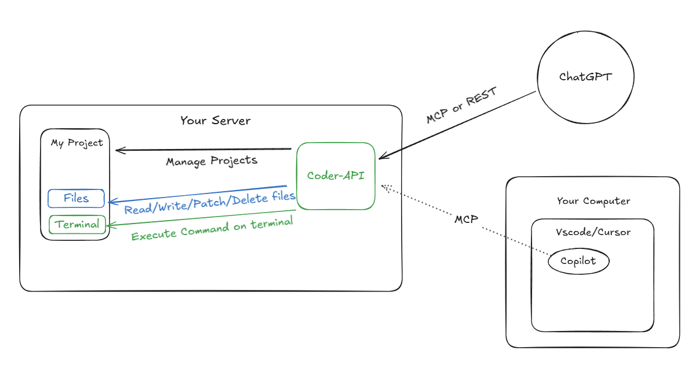

# Coder-API

**A powerful backend service that enables AI assistants to autonomously manage, modify, and execute code projects through secure sandboxed environments.**

Coder-API bridges the gap between AI models and code execution, providing a comprehensive toolkit for project management, file operations, and command execution. Built with dual protocol support (REST API + Model Context Protocol), it seamlessly integrates with ChatGPT, GitHub Copilot, and other AI assistants to enable autonomous coding workflows.

**Key Capabilities:**
- 🔧 **Project Management**: Clone repositories, create projects, manage workspaces
- 📁 **File Operations**: Read, write, patch, and organize code files with precision
- ⚡ **Code Execution**: Run bash commands and scripts in isolated project environments  
- 🤖 **AI Design**: Built with MCP support with automatic tool discovery for LLMs
- 🛡️ **Secure Sandbox**: All operations confined to designated workspace directories
- 🌐 **Flexible Deployment**: Local development, cloud platforms, or tunneled access

## Features

The server provides the following capabilities:

#### Project Management
- `create-project` - Create new projects from Git repositories, archives, or empty directories
- `rename-project` - Rename existing projects
- `list-projects` - Get a list of all projects
- `get-project-details` - Get detailed information about a specific project

#### File Operations
- `get-file` — Read file contents with support for text and base64 encoding
  - **What it does**: Returns the content of a file from a project workspace.
  - **Notes**: Handles large files via streaming/limits; can return raw text or base64 payloads.

- `create-file` — Create new files with overwrite protection
  - **What it does**: Creates a new file; by default falha se o arquivo já existir.
  - **Flags comuns**: `overwrite` para permitir substituição segura.

- `delete-file` — Delete files or directories with recursive options
  - **What it does**: Remove um arquivo único ou uma árvore de diretórios.
  - **Flags comuns**: `recursive`, `force`.

- `patch-file` — Apply modifications using various patch operations
  - **What it does**: Permite alterações por “patch ops” (diff, replace, lines, insert, code_block etc.).
  - **Exemplos**: trocar um bloco de código com contexto, inserir linhas em posições específicas, aplicar diffs.
### SSH (Experimental)

**Opt-in via env var**: set `SSH_ENABLED=true` to enable.

Capabilities:
- Generate SSH keypair in the project workspace (`.ssh/`)
- Read the public key

Docs: see [SSH API](./docs/api/ssh.md).
ead file contents with support for text and base64 encoding
- `create-file` - Create new files with overwrite protection
- `delete-file` - Delete files or directories with recursive options
- `patch-file` - Apply modifications using various patch operations (diff, replace, lines, insert, code_block)

#### System Operations
- `run-bash` - Execute bash commands in project directories with timeout and environment controls
- `list-filetree` - Browse project file structures with configurable depth and entry limits

## How we build it 

- Express server with dual protocol support:
  - **REST API** for traditional HTTP-based project and file management
  - **MCP (Model Context Protocol)** for seamless LLM integration
- OpenAPI contract (`openapi.json`)
- Multiple transport options for MCP (HTTP and Server-Sent Events)
- 
## Getting Started 

For detailed local setup instructions, see **[Running Locally](./docs/deploy/running-locally.md)**.

**Quick start:**
- Node.js >= 20
- [pnpm](https://pnpm.io/) (recommended)
- Clone, install dependencies, configure `.env`, and run `pnpm dev`

## Deployment

For detailed setup and deployment instructions, see our deployment guides:

- **[Running Locally](./docs/deploy/running-locally.md)** - Local development setup and testing
- **[Self-Hosted Server](./docs/deploy/self-hosted.md)** - Deploy on your own VPS or server
- **[Cloud Platforms](./docs/deploy/cloud-platforms.md)** - Deploy on Render, Heroku, Easypanel, and other cloud services  
- **[Local Tunneling](./docs/deploy/local-tunneling.md)** - Use ngrok or other tunneling services for development

To allow external services (like ChatGPT or other AI assistants) to access your Coder-API, you need to make it accessible over the internet using one of the deployment methods above.

---

## API Documentation

Coder-API provides two main interfaces:

### REST API
Traditional HTTP-based API for project and file management.
- **[REST API Documentation](./docs/api/rest-api.md)** - Complete REST API guide with examples
- **OpenAPI Contract**: `/openapi` endpoint or `openapi.json` file

### Model Context Protocol (MCP) 
Standardized protocol for AI assistant integration.
- **[MCP Overview](./docs/api/mcp.md)** - MCP protocol documentation and examples

## How To Use  
- **[ChatGPT MCP Integration](./docs/how-to-use/on_chatgpt_mcp.md)** - Using MCP with ChatGPT
- **[ChatGPT REST Integration](./docs/how-to-use/on_chatgpt_rest.md)** - Using REST API with ChatGPT
- **[VS Code Copilot Integration](./docs/how-to-use/on_copilot.md)** - Using with VS Code

## Security Notes

- All file operations are confined to `WORKSPACE_ROOT/{projectId}`.
- Bash commands are not fully network-isolated (MVP). Use in a controlled environment.
- See deployment documentation for security considerations specific to each deployment method.

## Contributing

1. Fork and clone the repo.
2. Create a feature branch.

3. Open a pull request with a clear description.
