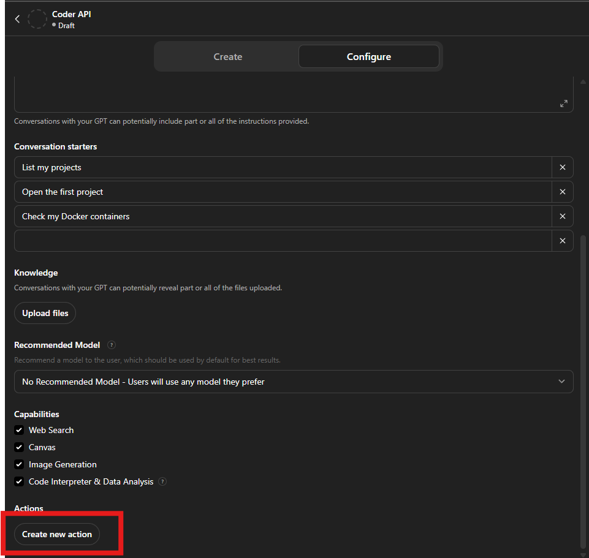
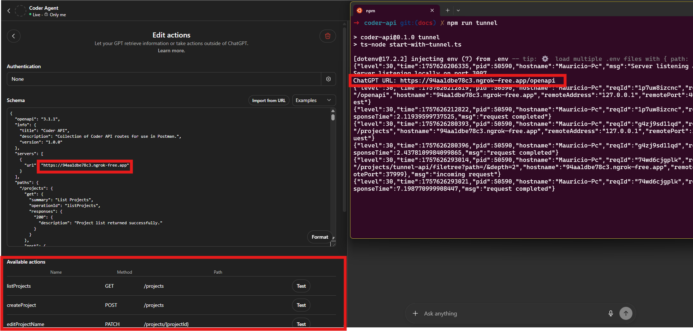

# Coder-API

A backend for an autonomous agent to be used through the ChatGPT UI. 


## How it works. 
- Coder-API runs on your computer and lets you access your files, folders, terminal.
- A tunnel connects your local API to the internet using Ngrok.
- Ngrok creates a link so that external services (like GPT) can reach your Coder-API.
- GPT (or other AI tools) can now interact with your computer’s resources by sending requests through this tunnel.


## Features

- Fastify server with REST API for project and file management
- TypeScript, Zod validation, Pino logging
- File operations, bash execution, and project isolation
- OpenAPI contract (`openapi.json`)

## Requirements

- Node.js >= 20
- [pnpm](https://pnpm.io/) (recommended)
- Docker (optional)

## Setup

1. **Clone the repository:**
   ```sh
   git clone https://github.com/MauricioMilano/coder-api.git
   cd coder-api
   ```

2. **Install dependencies:**
   ```sh
   pnpm install
   ```

3. **Configure environment variables:**
   Create a `.env` file (example) and update `WORKSPACE_ROOT` with the folder that will be your projects. This folder must start empty:
   ```
   PORT=3000
   WORKSPACE_ROOT=/srv/workspace
   ALLOW_NETWORK=false
   MAX_FILE_SIZE=5000000
   MAX_STDOUT_BYTES=2000000
   BASH_TIMEOUT_SEC=120
   MAX_UPLOAD_MB=20
   ```

4. **Run in development:**
   ```sh
   pnpm dev
   ```

5. **Build and run in production:**
   ```sh
   pnpm build
   pnpm start
   ```


## Exposing the API to ChatGPT

To allow ChatGPT (or any external service) to access your local backend, you must expose your server to the public internet using a tunneling service. This is required because ChatGPT cannot access localhost or private IPs directly.


### Exposing with Ngrok

This project includes a script to expose your local server using [ngrok](https://ngrok.com/).

**You might need to configure the npx package for ngrok.**

And to configure, you must create a ngrok account and get your token. It's free! 

After you create your account, go to https://dashboard.ngrok.com to get your token. 


Then apply it to internal ngrok.

```
npx ngrok config add-authtoken $YOUR_AUTHTOKEN
```


**To start the server and get a public URL:**

```sh
pnpm tunnel
```

You will see output like:

```
{"level":30,"time":1757608557875,"pid":7446,"hostname":"Mauricio-Pc","msg":"Server listening at http://0.0.0.0:3007"}
Server listening locally on port 3007
ChatGPT URL: https://my123url.ngrok-free.app/openapi
```

Use the ngrok URL in ChatGPT or any external client.

---

## GPT Usage
First, go to https://chatgpt.com/gpts and create your GPT.


Then fill your gpt with details and create an action. 


Then, choose the option to import url.and there you should paste your url there `your_app.ngrok-free.app/openapi`. Don't forget the /openapi. 


after you import the url, you should see the new tasks that your chatgpt can use: 




Then save it and enjoy your autonomous agent.

## API Usage

See `openapi.json` for the full contract.

### Example requests

- **Add a project:**
  ```sh
  curl -X POST http://localhost:3000/projects \
    -H 'Content-Type: application/json' \
    -d '{"source":{"local":{"mount":"workbench","path":"/my-project"}},"name":"my-project"}'
  ```

- **Read filetree:**
  ```sh
  curl 'http://localhost:3000/projects/prj_xxx/filetree?path=/&depth=2'
  ```

- **Read a file:**
  ```sh
  curl 'http://localhost:3000/projects/prj_xxx/files?path=/README.md'
  ```

- **Create a file:**
  ```sh
  curl -X POST http://localhost:3000/projects/prj_xxx/files \
    -H 'Content-Type: application/json' \
    -d '{"path":"/src/index.ts","content":"export {}","encoding":"text","create_parents":true,"overwrite":false}'
  ```

- **Run bash command:**
  ```sh
  curl -X POST http://localhost:3000/projects/prj_xxx/bash \
    -H 'Content-Type: application/json' \
    -d '{"command":"ls -la","workdir":"/","timeout_sec":10}'
  ```

## Security Notes

- All file operations are confined to `WORKSPACE_ROOT/{projectId}`.
- Bash commands are not fully network-isolated (MVP). Use in a controlled environment.

## Contributing

1. Fork and clone the repo.
2. Create a feature branch.
3. Add tests for new features (see `tests/` if available).
4. Run `pnpm lint` before submitting a PR.
5. Open a pull request with a clear description.
