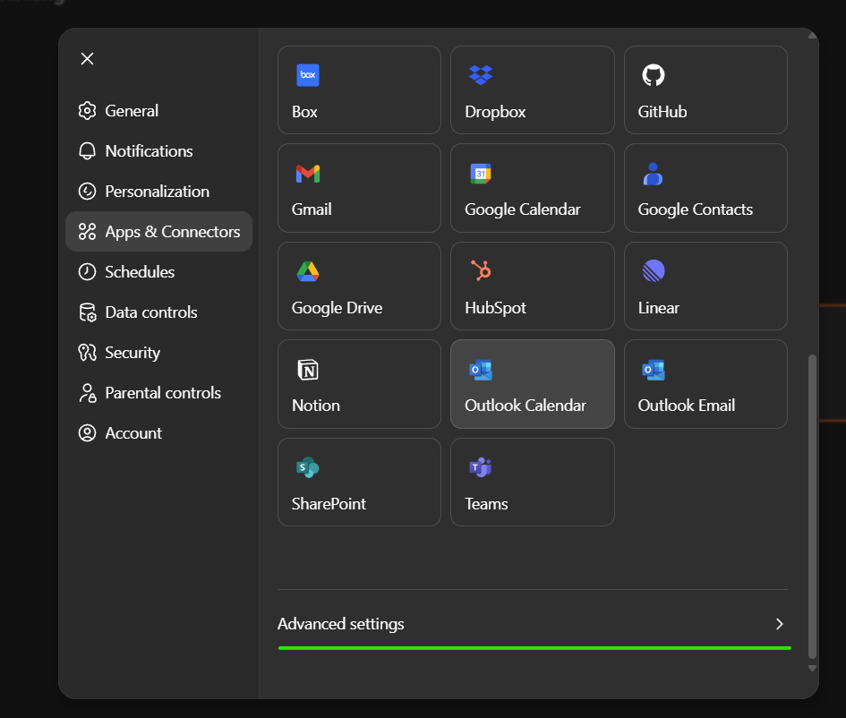
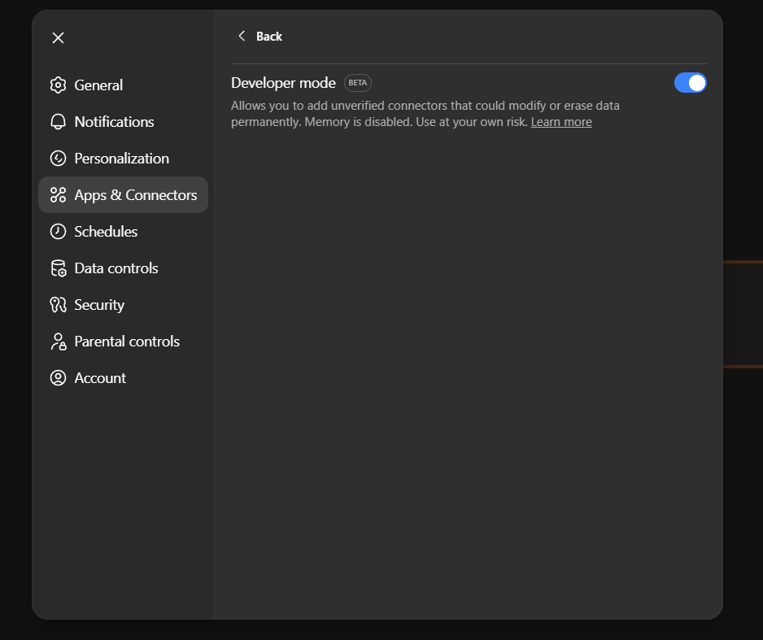
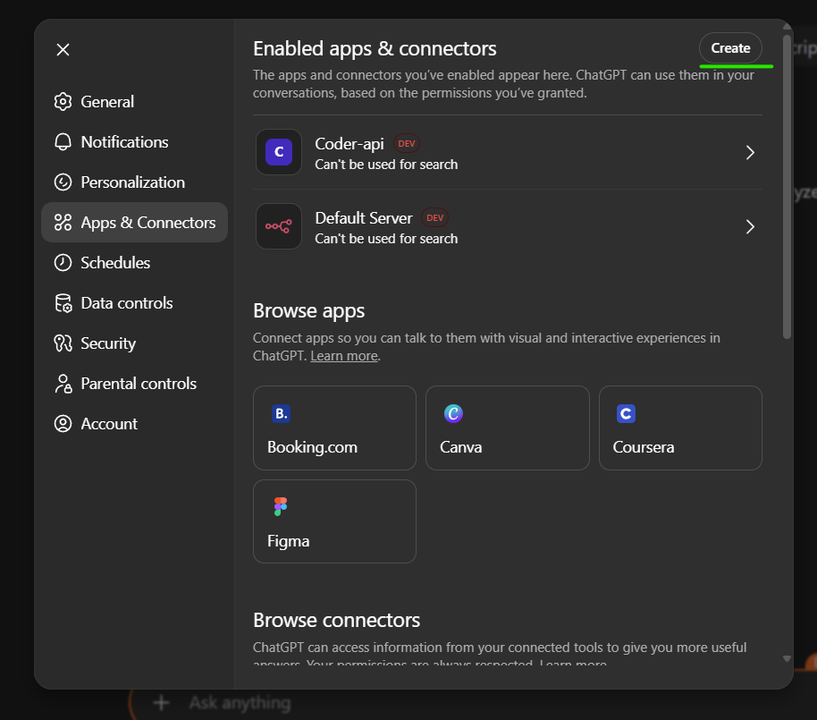
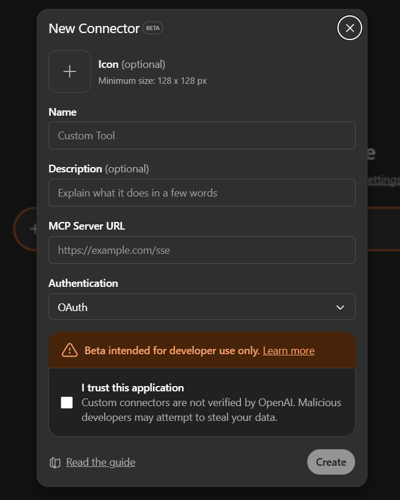
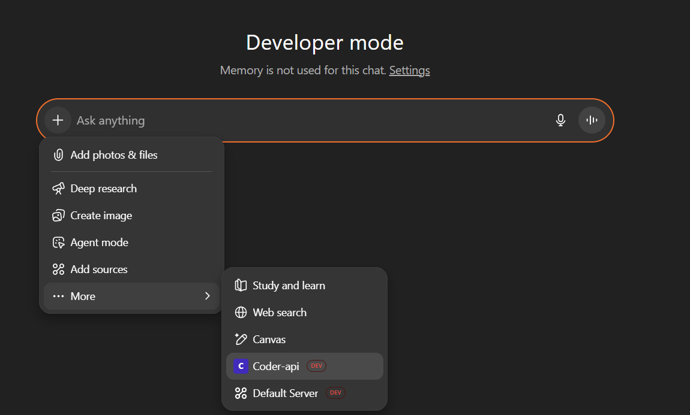

# Using Coder-API with ChatGPT (MCP Protocol)

## Overview

This guide explains how to set up Coder-API with ChatGPT using the Model Context Protocol (MCP). MCP provides a standardized way for AI models to interact with external tools and resources, offering better integration than traditional REST APIs.

## Prerequisites

- ChatGPT Plus or Team subscription
- Coder-API server running locally or deployed with public URL (using ngrok or similar tunnel)
- Internet access to your Coder-API instance

## What is MCP?

The Model Context Protocol (MCP) is designed specifically for AI-tool integration:
- **Native AI Support**: Built for LLM interactions
- **Tool Discovery**: Automatic capability detection
- **Type Safety**: Built-in schema validation with Zod
- **Real-time Communication**: Support for streaming and SSE
- **Standardized**: Industry standard for AI tool integration

## Setup Instructions

### 1. Start Your Coder-API Server 

The server will expose MCP endpoints:
- **HTTP Transport**: `http://<URL>:<PORT>/mcp`
- **SSE Transport**: `http://<URL:<PORT/mcp-sse`

### 2. Configure ChatGPT for MCP

OpenAI now supports MCP directly in ChatGPT! Follow these steps to connect your Coder-API server:

#### Step 1: Access ChatGPT Settings
1. Open ChatGPT and click on your profile/settings
2. Navigate to **Settings**

#### Step 2: Enable Developer Mode
1. Go to **Apps and connectors**
2. Scroll down to **"Advanced Settings"** and click on it

   

3. Enable **Developer mode**

   

#### Step 3: Add MCP Server
1. Scroll up and click on **"Create"** 

   

2. Configure your Coder-API MCP server:
   - **Name**: `Coder-API`
   - **URL**: `https://<URL>:<PORT>/mcp`
   - **Description**: `It is a mcp backend for autonomous coding agent`



#### Step 4: Using Coder-API
1. Start a new conversation
2. Click the **"+"** button to access tools
3. Go to **"... More"** and select **"Coder-API"**
4. You can now use all Coder-API capabilities directly in ChatGPT!

   

## Quick Start Examples

Once you've connected Coder-API via MCP, try these commands to get started:

### Basic Commands
- **"List all my projects"** - See existing projects
- **"Create a new React project called 'my-app'"** - Start a new project
- **"Show me the file structure of my project"** - Explore project files
- **"Read the package.json file"** - View file contents

### Advanced Operations
- **"Add error handling to the login function in auth.ts"** - Code modifications
- **"Run the test suite and show me any failures"** - Execute commands
- **"Create a new API endpoint for user registration"** - File creation
- **"Refactor this component to use TypeScript"** - Code improvements

### Development Workflow
- **"Clone the repository from github.com/user/repo and set it up"**
- **"Install the dependencies and start the development server"**
- **"Find all TODO comments in the codebase"**
- **"Generate a README.md file for this project"**


## Why Choose MCP over REST API?

With native ChatGPT support, MCP is now the recommended approach:

| Feature | MCP (Recommended) | REST API (Legacy) |
|---------|-----|----------|
| **Setup Complexity** | Simple - built into ChatGPT | Complex - requires custom GPT creation |
| **AI Integration** | Native, seamless experience | Manual HTTP requests via actions |
| **Tool Discovery** | Automatic capability detection | Manual API exploration |
| **Type Safety** | Built-in with Zod schemas | OpenAPI documentation |
| **Real-time** | Full SSE transport support | Limited HTTP responses |
| **Streaming** | Native progress reporting | Not available |
| **Error Handling** | Standardized MCP errors with context | Basic HTTP status codes |
| **Schema Evolution** | Built-in versioning | Manual API versioning |
| **User Experience** | Conversational, natural | More technical, action-based |

## MCP Tool Usage Examples

Once connected via MCP, interactions are more natural:

### Automatic Tool Discovery
The AI automatically discovers available tools:
- `create-project` - Project creation with validation
- `list-projects` - Project enumeration  
- `get-file` - File reading with encoding detection
- `create-file` - File creation with safety checks
- `patch-file` - Intelligent file modifications
- `run-bash` - Command execution with monitoring
- `list-filetree` - Directory traversal

### Natural Language Commands
- **"Create a React project from the official template"**
- **"Show me all TypeScript files in the src directory"**
- **"Add error handling to the API endpoint in server.ts"**
- **"Run the test suite and analyze any failures"**
- **"Refactor this component to use hooks instead of classes"**

### Intelligent Context Awareness
MCP provides better context understanding:
- Automatic file type detection
- Smart encoding selection
- Project structure awareness
- Dependency relationship understanding

## MCP Transport Options

### HTTP Transport (`/mcp`)
```javascript
// Standard HTTP-based MCP communication
POST /mcp
Content-Type: application/json

{
  "method": "tools/call",
  "params": {
    "name": "create-project",
    "arguments": {
      "source": { "git": { "url": "https://github.com/user/repo" } },
      "name": "my-project"
    }
  }
}
```

### Server-Sent Events (`/mcp-sse`)
```javascript
// Real-time streaming communication
GET /mcp-sse
Accept: text/event-stream

// Receives real-time updates during long operations
data: {"type": "progress", "operation": "git-clone", "percent": 45}
data: {"type": "complete", "result": {"projectId": "prj_abc123"}}
```

## Advanced MCP Features

### Schema Validation
MCP includes automatic validation:
```typescript
// Tools are automatically validated against Zod schemas
const createProjectSchema = z.object({
  source: z.union([
    z.object({ git: z.object({ url: z.string().url() }) }),
    z.object({ local: z.object({ path: z.string() }) })
  ]),
  name: z.string().min(1)
});
```

### Error Handling
Standardized MCP error responses:
```json
{
  "error": {
    "code": "INVALID_PARAMS",
    "message": "Project name cannot be empty",
    "data": {
      "field": "name",
      "value": "",
      "constraint": "minimum length 1"
    }
  }
}
```

### Progress Reporting
Real-time operation updates:
```json
{
  "type": "progress",
  "operation": "project-creation",
  "stage": "cloning-repository",
  "percent": 75,
  "message": "Downloading files..."
}
```

## Custom Instructions for MCP

Optimize your GPT for MCP usage:

```
You are an advanced AI development assistant using the Model Context Protocol (MCP) to interact with Coder-API.

MCP Guidelines:
1. Leverage automatic tool discovery - you don't need to guess available operations
2. Use the type-safe schemas provided by MCP for all tool calls
3. Take advantage of real-time progress updates for long operations
4. Handle MCP-specific errors with detailed context
5. Use streaming capabilities for better user experience
6. Rely on MCP's built-in validation for input checking

Development Best Practices:
1. Always check tool capabilities before assuming functionality
2. Use MCP's context awareness for better file operations
3. Leverage streaming for real-time feedback during builds/tests
4. Handle async operations properly with MCP's progress system
5. Use MCP's error context for better debugging assistance
```

## Security and Performance

### MCP Security Features
- **Schema Validation**: Prevents malformed requests
- **Type Safety**: Reduces runtime errors
- **Sandboxed Operations**: MCP tools run in controlled environments
- **Audit Logging**: Built-in operation tracking

### Performance Advantages
- **Efficient Communication**: Binary protocol options
- **Streaming Support**: Real-time updates reduce perceived latency
- **Connection Reuse**: Persistent connections for better performance
- **Smart Caching**: MCP can cache tool metadata

## Troubleshooting MCP

### Common MCP Issues

1. **"Cannot connect to MCP server"**
   - Ensure your Coder-API server is running and accessible
   - Verify the URL is correct: `https://your-tunnel-url.ngrok-free.app/mcp`
   - Check that your tunnel (ngrok) is active and not expired
   - Make sure the server is exposing the MCP endpoint properly

2. **"MCP server not responding"**
   - Check if your Coder-API server is running: `pnpm tunnel` or `pnpm dev`
   - Verify network connectivity between ChatGPT and your server
   - Check server logs for any errors or crashes
   - Ensure firewall settings allow incoming connections

3. **"Developer mode not available"**
   - Confirm you have ChatGPT Plus or Team subscription
   - Update your ChatGPT app/browser to the latest version
   - Try refreshing the settings page
   - Contact OpenAI support if the option is missing

4. **"Coder-API tools not appearing"**
   - Verify MCP server is properly configured and running
   - Check that tools are being registered correctly in server logs
   - Try removing and re-adding the MCP connection
   - Ensure the server URL ends with `/mcp` not just the base URL

5. **"Tool execution errors"**
   - Check your server's sandbox environment is properly set up
   - Verify file permissions and access rights
   - Monitor server logs for detailed error information
   - Ensure required dependencies are installed on the server

### Testing MCP Connection

```sh
# Test MCP server health
curl https://your-tunnel-url.ngrok-free.app/capabilities

# List available MCP tools
curl -X POST https://your-tunnel-url.ngrok-free.app/mcp \
  -H "Content-Type: application/json" \
  -d '{"method": "tools/list"}'

# Test tool execution
curl -X POST https://your-tunnel-url.ngrok-free.app/mcp \
  -H "Content-Type: application/json" \
  -d '{
    "method": "tools/call",
    "params": {
      "name": "list-projects",
      "arguments": {}
    }
  }'

# Test SSE transport
curl -N https://your-tunnel-url.ngrok-free.app/mcp-sse
```

## Environment Configuration

Optimize for MCP usage:

```env
# MCP-specific settings
MCP_TRANSPORT=http,sse
MCP_MAX_CONNECTIONS=10
MCP_HEARTBEAT_INTERVAL=30

# Enhanced capabilities for MCP
MAX_FILE_SIZE=20000000
MAX_STDOUT_BYTES=10000000
BASH_TIMEOUT_SEC=600

# Real-time features
ENABLE_PROGRESS_REPORTING=true
ENABLE_STREAMING_RESPONSES=true
```

## MCP Integration is Here!

OpenAI has officially added native MCP support to ChatGPT, bringing:
- **Direct MCP Protocol Support**: No more workarounds or bridges needed
- **Enhanced Tool Discovery**: Automatic capability detection and validation
- **Real-time Communication**: Full streaming and SSE support
- **Deep AI Integration**: Native understanding of development workflows
- **Growing Ecosystem**: More MCP-compatible tools and services daily

## Benefits of Native MCP Support

With official MCP integration in ChatGPT, you now get:

### Enhanced Development Experience
- **Seamless Tool Access**: No custom GPT setup required
- **Natural Conversations**: Just ask ChatGPT to code, and it will use Coder-API automatically
- **Real-time Feedback**: See progress as projects are created, files are modified, and commands run
- **Context Awareness**: ChatGPT understands your project structure and development environment

### Improved Reliability
- **Direct Integration**: No intermediary layers or action bridges
- **Better Error Handling**: Rich error context and suggestions
- **Automatic Retries**: Built-in resilience for network issues
- **Type Safety**: Reduced errors through schema validation

### Future-Ready Development
- **Standard Protocol**: Built on the emerging industry standard for AI-tool integration
- **Extensible**: Easy to add new tools and capabilities
- **Ecosystem Growth**: Compatible with other MCP-enabled tools and services
- **Continuous Updates**: Benefits from ongoing MCP protocol improvements

## Next Steps

Your ChatGPT is now a powerful development assistant with:
- **Full Project Management**: Create, clone, and manage projects
- **Intelligent File Operations**: Read, write, and modify files with context awareness
- **Command Execution**: Run bash commands and see real-time output
- **Code Intelligence**: Understand project structure and dependencies
- **Development Workflows**: Handle complex multi-step development tasks

Start by trying the Quick Start examples above, or just ask ChatGPT to help with your current development project!